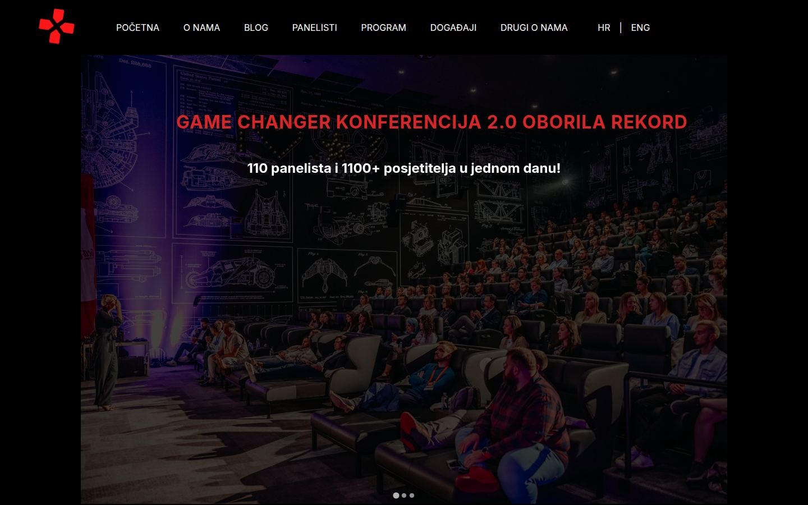
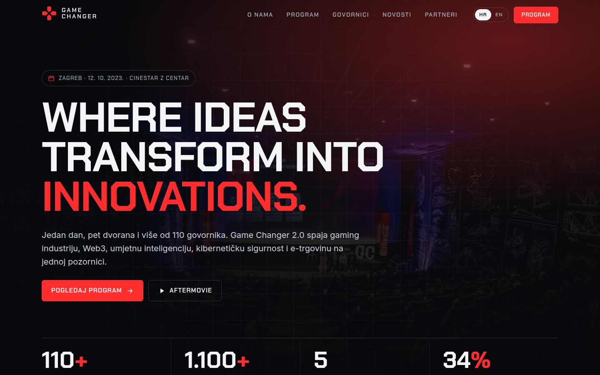
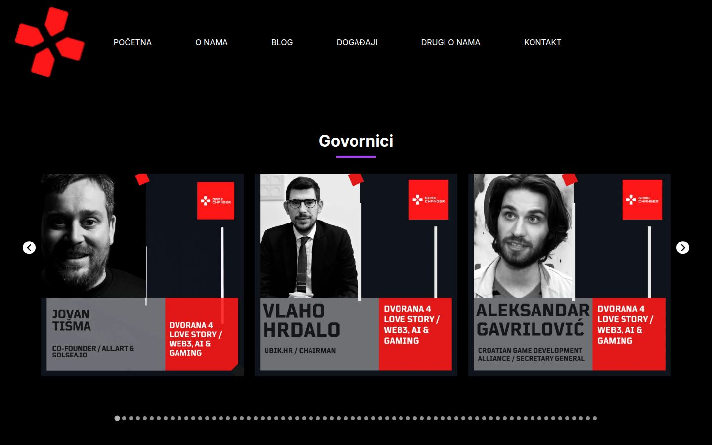
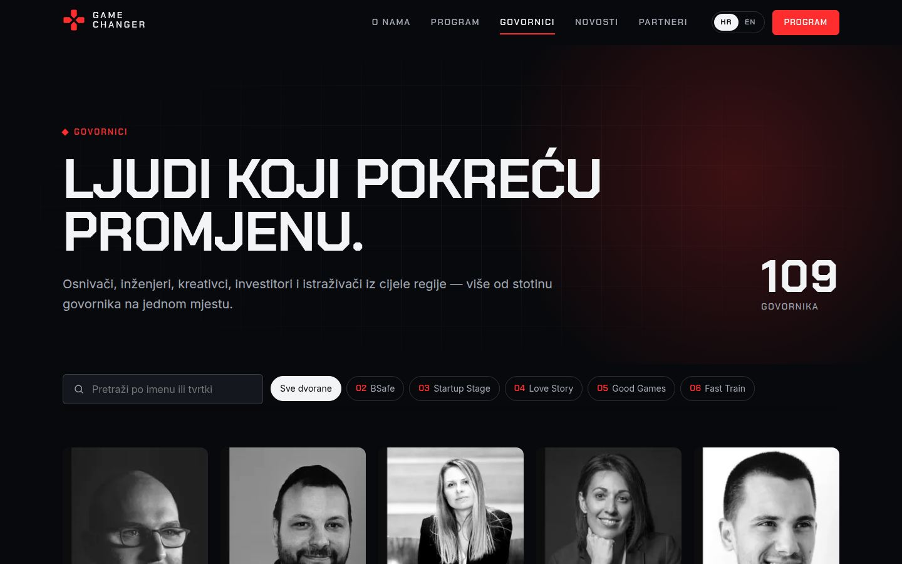
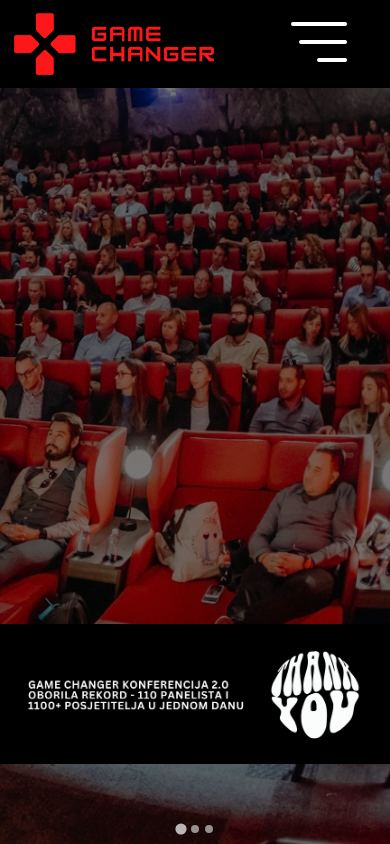
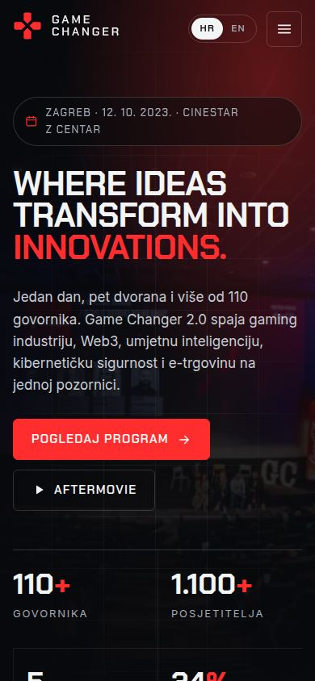
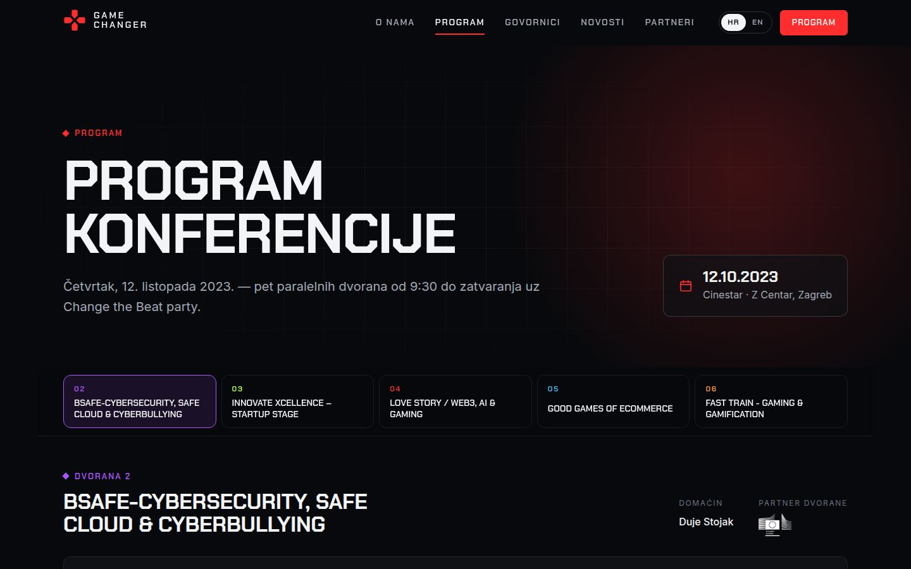

<div align="center">
  

  <h1>Game Changer — conference website</h1>

  <p>
    A 2026 rebuild of the website I made for my first client in 2023:
    <strong>Game Changer</strong>, a gaming, Web3 &amp; AI business conference in Zagreb and Ljubljana.
  </p>

  <p>
    
    
    
    
  </p>
</div>

> [!NOTE]
> The Game Changer business has since closed. This repository is a portfolio piece: the content, brand and
> photography belong to Game Changer and its partners, and are reproduced here only to show the work.

## Before → after

|                                    2023 (original)                                    |                                   2026 (this rebuild)                                   |
| :-----------------------------------------------------------------------------------: | :-------------------------------------------------------------------------------------: |
|          |            |
|  |  |
|      |        |

<p align="center">
  
</p>

## What changed

The original was my first real project: ~20 hand-written HTML pages (Croatian + English copies of each),
one 47 KB stylesheet, a 314 KB `index.html` with base64-inlined images, Splide carousels, a Font Awesome kit
and 112 speaker photos that were really Instagram graphics with names baked into the pixels.

| | 2023 | 2026 |
| --- | --- | --- |
| Stack | Static HTML, copy-pasted per page and language | [Astro](https://astro.build) static site, TypeScript (strict) |
| Content | Hard-coded in markup, HR and EN drifted apart | Structured JSON + Markdown content collections, one source for both languages |
| Repository size | ~88 MB | ~7 MB of source assets |
| Homepage HTML | 314 KB | 94 KB (16 KB gzipped) |
| Client-side JS | Splide, Font Awesome kit, vanilla-tilt, hand-rolled popup scripts | 2–3 KB of inline vanilla JS per page, no libraries |
| Images | Unoptimised JPEG/PNG, some 6912 px wide | Responsive `srcset` WebP generated at build time |
| Speakers | Social cards with text in the image, `alt="Panelist"` | Cropped portraits, real names/roles in HTML, searchable and filterable by hall |
| Program | 5 carousels of `<div>`s | Accessible tabs, timeline per hall, speaker chips linking to bios |
| Privacy | Google Fonts, YouTube iframe, Font Awesome on every load | Self-hosted fonts, YouTube loads only after clicking play, no cookies |
| SEO | Partial meta tags | Canonical + `hreflang`, Open Graph per article, JSON-LD, sitemap |

### Highlights

- **Bilingual by design** — Croatian at `/`, English at `/en/`, with localised slugs (`/govornici/` ↔ `/en/speakers/`) and a language switcher that keeps you on the equivalent page.
- **Speakers directory** — 109 speakers, diacritic-insensitive search, filter by hall, and a deep-linkable `<dialog>` bio (`/govornici/#hajdi-cenan`) showing every session the person appears in.
- **Program** — five parallel halls as a keyboard-navigable tab list (arrow keys), progressive enhancement: without JS every hall is simply listed.
- **Design system** — dark, signal-red brand kept from the original, Chakra Petch + Inter, a vector SVG redraw of the d-pad logo (the original only existed as raster PNGs), reduced-motion support everywhere.
- **Data rescue** — a one-off script parsed the legacy HTML into `src/data/*.json` (speakers, program, partners, press), fixed casing and machine-translation leftovers, and cropped clean portraits out of the speaker graphics.

## Getting started

Requires Node 22.12+ (see `.nvmrc`).

```bash
npm install
npm run dev       # http://localhost:4321
npm run build     # type-check (astro check) + static build to dist/
npm run preview   # serve the production build
```

## Project structure

```text
src/
├── assets/              # images processed by astro:assets (speakers, partners, photos)
├── components/          # Header, Footer, Logo, SpeakerCard, PartnerWall, VideoFacade, …
├── content/
│   ├── news/{hr,en}/    # articles as Markdown, paired across languages by `key`
│   └── pages/{hr,en}/   # privacy policy
├── data/                # speakers.json, program.json, sponsors.json, media.json
├── i18n/                # routes, UI strings, URL helpers
├── layouts/Base.astro   # <head>, SEO, header/footer
├── lib/                 # typed data access + news helpers
├── pages/               # thin route files (HR at root, EN under /en)
├── styles/global.css    # tokens, reset, shared primitives
└── views/               # page templates shared by both languages
```

### Editing content

- **Speakers** — `src/data/speakers.json` (portrait in `src/assets/speakers/<id>.webp`).
- **Program** — `src/data/program.json`; sessions reference speakers by `id`.
- **News** — add `src/content/news/hr/<slug>.md` and `src/content/news/en/<slug>.md` with the same `key`.
- **UI copy** — `src/i18n/index.ts`.

## Deployment

`.github/workflows/deploy.yml` builds and publishes to **GitHub Pages** on every push to `main`.
Enable it once under *Settings → Pages → Source: GitHub Actions*. The workflow passes the Pages URL and
base path to the build, so it works both as `https://<user>.github.io/<repo>/` and on a custom domain.

For any other static host, run `npm run build` and upload `dist/`. Set `SITE_URL` (and `BASE_PATH` if the
site is not served from the domain root) to get correct canonical URLs and sitemap entries.

## Credits

- Original website (2023) and this rebuild by **Marin Sabo**.
- Content, brand and photography © Game Changer and the respective speakers, partners and media outlets.
